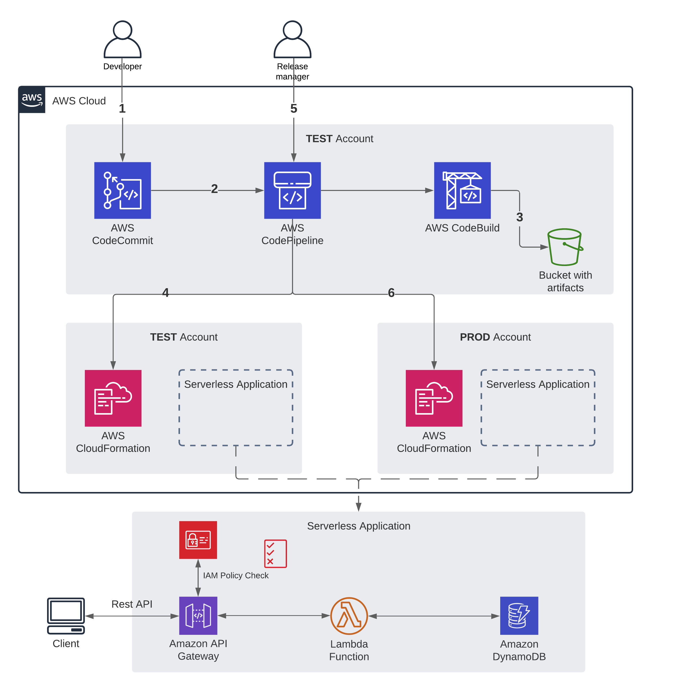
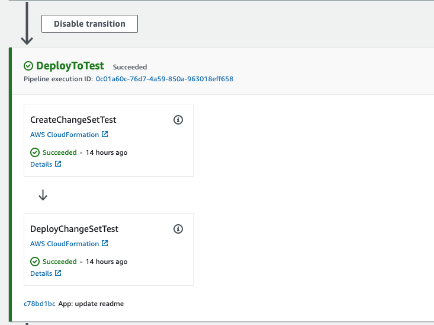
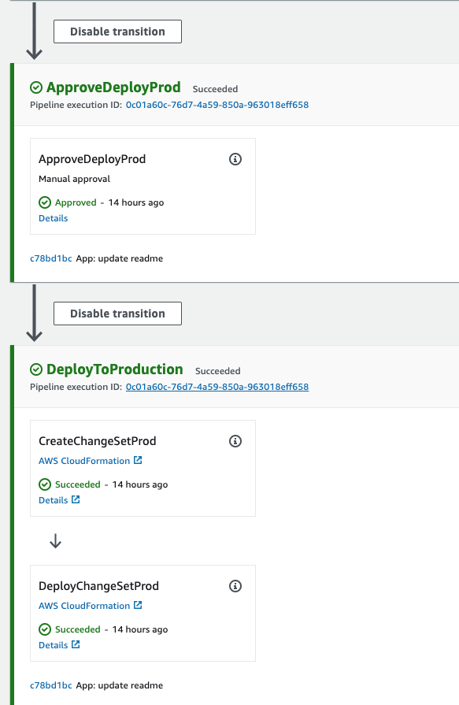

# CI/CD pipeline for Serverless application
[](https://opensource.org/licenses/Apache-2.0)
## Building, testing, and deploying Serverless application using CodeBuild and CodePipeline


## Table of contents
* [General info](#general-info)
* [Solution](#solution)
* [Setup](#setup)
* [Cleanup](#contact)

## General info
This project includes the following files and folders.

## Solution


1. Developer deploys the code into CodeCommit
2. CodePipeline start execution
3. CodeBuild outputs artifacts into S3 bucket
4. CodePipeline deploys CloudFormation stack in TEST account
5. Release manager reviews changes and approves/rejects in CodePipeline
6. If changes are approved CodePipeline deploys CloudFormation stack to the Production AWS account

## Setup:

### Pre-requisites
1. Install the AWS CLI.
2. Intall the SAM CLI.
3. Clone this repository.
4. Have the following AWS accounts: Test and Production

### 1. Create [AWS CodeCommit](code-commit-url) repository in TEST Account
##### Console Method
Follow the [instructions here](http://docs.aws.amazon.com/codecommit/latest/userguide/getting-started.html#getting-started-create-repo) to create a CodeCommit repository in the TEST Account.

##### Terminal Method
From your terminal application, execute the following command. You may refer [here](http://docs.aws.amazon.com/codecommit/latest/userguide/how-to-create-repository.html#how-to-create-repository-cli) for further details on installing the AWS CLI if needed.

```console
aws codecommit create-repository --repository-name {YOUR REPO NAME} --repository-description "Serverless App" --profile {{TEST-ACCOUNT-PROFILE}}
```

Note the cloneUrlHttp URL in the response from above CLI.
#### 2. Add a new remote

From your terminal application, execute the following command:

```console
git remote add AWSCodeCommit {{HTTP_CLONE_URL_FROM_STEP_2}}
```

Follow the instructions [here](http://docs.aws.amazon.com/codecommit/latest/userguide/setting-up.html) for local git setup required to push code to CodeCommit repository.

#### 3. Push the code AWS CodeCommit

From your terminal application, execute the following command:

```console
git add .
git commit -m "First push of my SAM app!"
git push -u origin dev
```

### 4. Create pipeline
```bash
cd cloudformation
./create-pipeline.sh
```
### 5. See the pipeline in action.
Once you have your pipeline configured across your AWS accounts, codepipeline will listen for new deployments to your repository.





## Cleanup

To delete the application, use the AWS CLI.

```bash
cd cloudformation
./destroy.sh
```